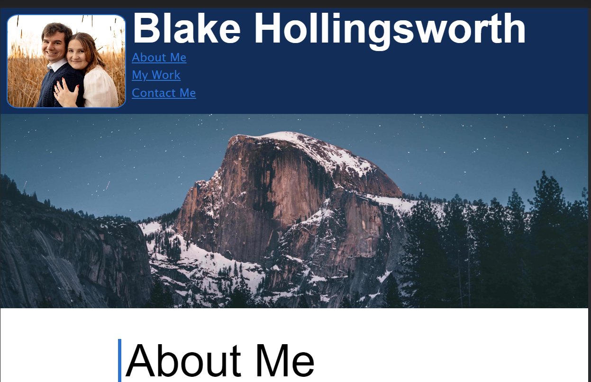

# Challenge 2 -- Personal Portfolio

## Description

This is a website coded in HTML, and CSS. It contains a header with my name, a picture of me, and links to the sections below. I also included a hero image, links to my past projects in the form of images, and links to my social media and email at the bottom.  

This site is for employers to see a more mainstream form of my resume and for me to show off some of my skills as a front end developer.

## Installation

The website is hosted with github pages and can be accessed at [this link](https://blakee-37.github.io/Challenge-2/)

Below is an image of the loaded website.

## Usage

Use the links in the header to auto scroll to the respective section. Click on each project image to be directed to the corresponding projects github repo.

## Credits
##### Links to sites where I found solutions to issues I was having
* [Issue with image sizing](https://www.geeksforgeeks.org/how-to-get-rid-of-the-gap-under-the-image/)
* [Issue with text sizing](https://stackoverflow.com/questions/20304472/how-to-make-the-font-size-smaller-when-i-resize-the-browser)

## License

MIT License

---